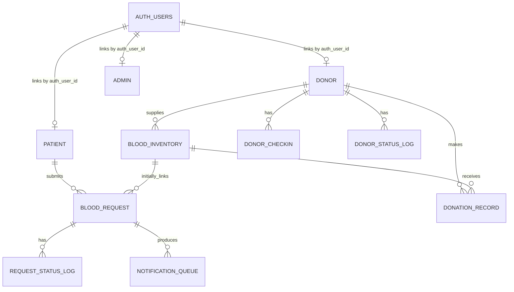

# VeinDrop / BloodConnect: Complete System Context for Thesis Writing Assistants

> **Superseded:** Use `SYSTEM_KNOWLEDGE_FOR_AI.md` for the current September 14, 2026 system, workflow, and database context. This older snapshot is retained only for history.

> Repository snapshot reviewed: September 1, 2026  
> Purpose: Give Claude, ChatGPT, Gemini, or another AI assistant enough verified context to help write the thesis about this system without inventing features, database objects, results, or technical claims.

## Instructions to the AI assistant

Treat this document as the primary factual context for the project. When helping with a thesis chapter, proposal, defense script, diagram, questionnaire, abstract, or technical explanation:

1. Use **VeinDrop** as the current product name. Mention **BloodConnect** only as the former/internal name still present in legacy filenames and source-code comments.
2. Clearly distinguish among:
   - **Implemented and database-backed** features;
   - **Implemented interface or prototype/demo** features that use fixed/sample/local browser data; and
   - **Recommended future improvements**.
3. Do not claim that a prototype feature is fully operational, externally integrated, deployed, clinically validated, or tested unless the user supplies evidence.
4. Do not invent research findings, respondent counts, accuracy rates, performance results, hospital partnerships, compliance certifications, or usability scores.
5. The repository describes the software implementation, not the completed research methodology. Ask the user for their school format, study locale, respondents, evaluation instrument, results, and required citation style when those details are needed.
6. Do not reproduce credentials, API keys, passwords, personal donor data, or other secrets in thesis output.
7. When the source and intended design differ, describe both. Label the current behavior as **implemented behavior** and the safer or more complete behavior as **recommended design**.

---

## 1. System identity and purpose

**Current name:** VeinDrop  
**Former/internal name:** BloodConnect  
**System type:** Web-based and installable Progressive Web Application (PWA) for blood donor, blood request, and blood inventory management.

VeinDrop is designed to help patients or recipients submit blood requests, let eligible users maintain donor profiles, protect donor location and contact information, and give blood-bank administrators a central interface for managing donors, inventory, request status, and operational reports.

The main operational idea is to connect four related processes:

1. Account and role management;
2. Donor registration and donation lifecycle management;
3. Patient blood-request processing;
4. Blood inventory monitoring and deduction during fulfillment.

The system is especially oriented toward privacy-safe donor discovery in Bohol. Its live donor query returns only limited fields and its maps show approximate grouped zones instead of exact donor home coordinates.

### Core objectives represented by the implementation

- Centralize patient, donor, request, donation, and inventory records.
- Give recipients a traceable request workflow.
- Give administrators visibility over blood availability and urgent needs.
- Prevent invalid blood-type values through normalization and database constraints.
- Enforce a 56-day waiting period between recorded donations.
- Allow one authenticated person to have a patient profile, a donor profile, or both.
- Reduce exposure of donor identity, address, and contact data on the patient-facing map.
- Provide audit records for donor and request status changes where the relevant insert succeeds.

---

## 2. Users and roles

### 2.1 Visitor

A visitor can view the landing and information pages, choose registration or login, and begin either the patient or donor account flow. Protected dashboards redirect unauthenticated visitors to the login page.

### 2.2 Patient / recipient

A patient can:

- Register and sign in;
- Maintain a patient profile;
- Submit a blood request;
- View and filter their own requests;
- Track request states and read an administrator note;
- Receive live refreshes when their request row changes;
- Search privacy-safe donor zones by a specific or compatible blood type;
- View the blood-drive interface;
- Activate donor features on the same account.

The UI uses “patient” and “recipient” for the same general role. The Supabase domain table and code use `patient`.

### 2.3 Donor

A donor can:

- Register a donor profile using an authenticated account;
- View donor status and eligibility information;
- View personal donation history;
- View approved requests that are compatible with their blood type;
- Pause or resume availability, subject to medical deferral and the 56-day waiting rule;
- Also activate patient features on the same account.

A donor is not automatically medically approved merely by registering. Staff still manage the donor lifecycle.

### 2.4 Administrator

An administrator can:

- Access the protected administration dashboard;
- View overview statistics and recent activity;
- Add and inspect donor records;
- Configure whether a donor may appear on the patient map;
- Check in, medically approve, record donation for, or defer a donor;
- Add and monitor blood stock;
- Review blood requests and perform valid status transitions;
- Deduct inventory when fulfilling an approved request;
- View report-style charts and inventory expiration information;
- Receive browser-side dashboard notifications for new requests and system activity.

Admin membership is normally checked against `blood_bank.admin`. The code also contains a fallback list of known administrator email addresses for compatibility. This fallback should be treated as a prototype/legacy mechanism, not the preferred long-term authorization design.

### 2.5 Multi-role account behavior

One Supabase Auth identity may link to both a `patient` row and a `donor` row through `auth_user_id`. Database links returned by `get_my_account_profiles()` are intended to be the authoritative capabilities. Auth user metadata also stores role hints and legacy identifiers for compatibility, but editable metadata should not be the sole authority for access decisions.

Administrator accounts are prevented by the role-activation database functions from activating ordinary patient or donor features.

---

## 3. System architecture

### 3.1 High-level architecture

```text
User browser
  |-- Public/landing pages and protected dashboards (HTML, CSS, JavaScript)
  |-- React/Vite PWA landing shell
  |-- Supabase JavaScript client
  |-- Leaflet + OpenStreetMap for maps
  |-- Chart.js for dashboard charts
  |
  +--> Supabase Auth (identity, sessions, email recovery)
  +--> Supabase Postgres
  |      |-- blood_bank schema: operational data
  |      |-- public schema: password-reset security/audit data
  |      +-- Row Level Security, triggers, RPC functions, Realtime
  `--> Supabase Edge Functions (privileged/admin and password-reset work)
```

### 3.2 Front-end technologies

- HTML5, CSS3, and substantial inline JavaScript for the main operational screens;
- React 18 and Vite 6 for the `index.html` PWA landing/dashboard shell;
- Supabase JavaScript SDK loaded by the HTML pages;
- Leaflet with OpenStreetMap tiles for the Bohol donor map;
- Chart.js for admin trend and reporting charts;
- Font Awesome and Google Fonts for presentation;
- Responsive layouts and mobile navigation;
- A web app manifest and service worker for installability and limited app-shell caching.

The system uses a unified landing implementation:

- `index.html` is the standalone marketing home page and entry point.

### 3.3 Back-end and data technologies

- Supabase Auth for primary authentication and session management;
- PostgreSQL through Supabase for primary operational data;
- PostgREST queries and PostgreSQL RPC functions through the Supabase SDK;
- Supabase Realtime subscriptions for blood-request and inventory change events;
- Deno/TypeScript Supabase Edge Functions for privileged tasks;
- Retired PHP/PDO/MySQL compatibility source retained outside the production build.

### 3.4 Main application pages

| File | Purpose | Data status |
|---|---|---|
| `index.html` | Public marketing home page | Static presentation/navigation |
| `learn_more.html` | System feature explanation | Static content |
| `register.html` | Four-step account registration | Supabase-backed |
| `login.html` | Login and role-based routing | Supabase Auth |
| `forgot-password.html` | Email OTP password-reset flow | Supabase Edge Function |
| `account_dashboard.html` | Patient and donor self-service portal | Mostly Supabase-backed; some fixed/local features |
| `donor_registration.html` | Adds donor capability/profile to signed-in account | Supabase RPC-backed |
| `recipient_donor_map.html` | Privacy-safe Bohol donor-zone map | Supabase RPC with fixed sample fallback |
| `account_notifications.html` | Full notification interface | Browser-local read/deleted state and fixed page items |
| `admin_dashboard.html` | Admin operations, reports, requests, donors, inventory | Mainly Supabase-backed; some fixed/local features |

---

## 4. End-to-end processes

### 4.1 Registration process

1. The user chooses an initial role: patient or donor.
2. The registration interface collects personal information, blood type, date of birth, account details, gender, and account details.
3. Client validation checks:
   - Email structure and several common domain misspellings;
   - A real date of birth from year 1900 through the current date;
   - Minimum age of 18 when the starting role is donor;
   - A password of at least 10 characters with uppercase, lowercase, number, and special character;
   - Rejection of several common passwords and a password containing the username;
   - One of the eight canonical ABO/Rh blood types.
4. Supabase Auth creates the identity and stores profile hints in user metadata.
5. If a session is immediately available, the system activates the chosen domain profile:
   - Patient registration creates or links `blood_bank.patient`;
   - Donor registration creates or links `blood_bank.donor`.
6. The user is sent to login. If email confirmation is enabled in Supabase, final domain-profile activation can occur after the confirmed user signs in.

### 4.2 Login and routing process

1. The user submits email and password.
2. Supabase Auth is tried first.
3. If a known administrator has valid credentials only in the domain `admin` table, the `bootstrap-admin-auth` Edge Function can create or update the corresponding Supabase Auth identity, after which login is retried.
4. After Supabase login, the system resolves the profile:
   - Known/database-backed admin -> admin profile;
   - Otherwise -> linked patient/donor profiles and combined roles.
6. Admins are routed to `admin_dashboard.html`; other authenticated roles are routed to `account_dashboard.html`.
7. Protected pages call `requireAdmin()` or `requireAuth()` and redirect to login if access is missing.

### 4.3 Activating a second role

The same non-admin account can possess both patient and donor capabilities.

- A donor can activate patient features from the shared dashboard. The database function creates or links a patient profile.
- A patient can choose “Become a Donor,” complete donor registration, and link a donor profile to the same Auth user.
- The UI then labels the account “Patient & Donor” and allows switching between the relevant sections without creating a second login.

### 4.4 Patient profile management

1. The system loads the signed-in user's linked patient record.
2. The user can edit first, middle, and last name, blood type, gender, phone, and address.
3. Patient-domain fields are saved to `blood_bank.patient`.
4. Common display fields and gender are also copied to Supabase user metadata for compatibility.
5. Profile photographs are currently stored as browser-local data, not in shared database/object storage. They therefore do not reliably follow the user across browsers or devices.

### 4.5 Blood-request submission

1. The patient opens the request modal.
2. The form collects blood type, 1–20 units, urgency (`normal`, `urgent`, or `critical`), and additional notes.
3. The system resolves or creates the authenticated user's patient ID.
4. It normalizes and validates the blood type.
5. If no inventory ID was supplied, it looks for a positive-stock inventory row with the exact requested blood type, excluding `expired` and `quarantined` rows.
6. If no matching positive inventory exists, the current implementation rejects submission and tells the patient to contact the blood bank.
7. Otherwise, it inserts a `blood_request` with status `pending` and links it to both the patient and a matching inventory row.
8. The patient list refreshes, and Supabase Realtime later refreshes it whenever that patient's request rows change.

**Important implementation detail:** the form collects `notes`, but the current Supabase insert does not write that form value to the request row. The database `note` field is currently used mainly for the administrator's transition reason/note. Also, hospital is displayed from the linked patient or a generic “Blood Bank” fallback because the Supabase `blood_request` table does not contain a separate hospital field.

### 4.6 Blood-request status workflow

The implemented state machine is:

```text
pending
  |-- approved --> fulfilled
  |       |------> needs_clarification
  |       `------> rejected
  |-- needs_clarification
  `-- rejected

needs_clarification, rejected, and fulfilled are terminal in the current UI.
```

Allowed transitions:

| Current state | Allowed next states |
|---|---|
| `pending` | `approved`, `needs_clarification`, `rejected` |
| `approved` | `fulfilled`, `needs_clarification`, `rejected` |
| `needs_clarification` | None |
| `rejected` | None |
| `fulfilled` | None |

For every transition, an admin selects a reason. The UI combines the reason and optional note and saves it in `blood_request.note`. It then attempts to insert an append-only entry in `blood_request_status_log`.

Additional rules:

- Approval is blocked if total valid stock for the exact blood type is zero or less than the requested quantity.
- Only an approved request may be fulfilled.
- Fulfillment is blocked if available stock is less than the requested quantity.
- When clarification is requested, the system attempts to queue SMS and/or email messages if patient contact values are available.
- No outbound SMS or email worker/provider is included in the repository; queue entries should not be described as confirmed delivered notifications.

### 4.7 Inventory deduction during fulfillment

The implemented algorithm is a greedy, oldest-stock-oriented deduction:

1. Put the request's linked inventory row first if it matches the blood type and is usable.
2. Load other positive inventory rows ordered by `date_stock` ascending.
3. Ignore rows for another blood type and rows marked `expired` or `quarantined`.
4. Sum available units and stop if the total is insufficient.
5. For each candidate, deduct `min(row units, remaining request units)`.
6. Mark a row `depleted` when its remaining units reach zero.
7. Stop when the request quantity has been covered.
8. Set the request to `fulfilled` and associate it with the first inventory row used.

This resembles first-expiring/oldest-stock consumption but does not explicitly sort by `expiry_date`; it sorts fallback rows by `date_stock`.

**Current reliability limitation:** deductions and the final request update are separate browser-issued operations, not one PostgreSQL transaction. If a later update fails, earlier row deductions are not automatically rolled back. A production-grade implementation should move validation, locked row selection, deduction, request update, and audit insertion into one server-side transaction/RPC.

### 4.8 Donor registration and lifecycle

The normal donor lifecycle is:

```text
registered --> checked_in --> approved (medical) --> donated
     |              |                 |
     `--------------+-----------------> deferred
```

An `incomplete` display state also exists for compatibility.

Detailed flow:

1. **Registration:** an authenticated adult supplies identity, contact, blood type, gender, birth date, and address. The database links or creates the donor row. A duplicate phone number linked to another donor is rejected by the multi-role activation function.
2. **Availability:** the donor may pause availability. A medically deferred donor cannot enable it, and a donor within 56 days of the last donation cannot become available.
3. **Map review:** an admin controls `show_on_map`, `location_status`, and `map_area`. A donor appears in the patient query only when map display is enabled and the location status is verified.
4. **Check-in:** admin sets `donor_status = checked_in` and records a timestamp. The system attempts to add check-in and status-log entries.
5. **Medical approval:** admin changes the status to `approved` after screening and attempts to log the change.
6. **Donation:** admin records units and blood type. The system:
   - Checks the 56-day rule in the client and again through a database trigger on the donor update;
   - Sets status/last donation date;
   - Creates a new `blood_inventory` row;
   - Attempts to create a `donation_record` and a donor status-log row;
   - Calculates the next eligible date as 56 days later.
7. **Deferral:** admin records a reason and sets both donor and availability state to deferred.

Some audit inserts and the donation record insert are explicitly “best effort.” A failure can leave the main donor/inventory update successful without the corresponding secondary record. This is another candidate for a single transactional server-side function.

### 4.9 Inventory management

- Each inventory row is linked to a donor and represents stock of one blood type.
- Recording a donation creates a new inventory row.
- An admin can also add stock manually. If a recent row for that blood type exists, units are added to it; otherwise a matching donor must be selected or found before a row can be created.
- Dashboard totals group all inventory rows by normalized blood type.
- Display classification is:
  - Critical: 0–5 units;
  - Low: 6–15 units;
  - Adequate: more than 15 units.
- The optional schema enhancement adds a generated bag ID, remarks, and an expiry date initialized to 42 days after stocking.
- `auto_expire_inventory()` changes eligible old rows to `expired`, but it is a callable function rather than a scheduled job in this repository. Automatic daily execution is not demonstrated.

### 4.10 Donor matching and privacy-safe map

1. The patient chooses “Compatible” or a specific blood type.
2. For “Compatible,” the UI uses standard red-cell recipient compatibility to determine allowable donor blood types.
3. The database RPC `list_visible_donors()` returns only:
   - Donor ID;
   - Blood type;
   - Availability and donor status;
   - Map visibility and verification status;
   - Approximate map area;
   - Last donation date.
4. It excludes donors who are not approved for map display.
5. The browser groups donors into fixed Bohol zones. If `map_area` exactly matches a known zone, that zone is used; otherwise a deterministic hash of the donor identifier assigns a zone.
6. The map displays area/count summaries and directs contact through the blood bank. It does not expose email, phone number, full street address, or an exact home pin.
7. If the live donor call fails, fixed sample donor counts and profiles are displayed and labeled as sample zones.

The standalone map also calculates a deterministic display distance when no actual distance exists. This number is a presentation estimate, not GPS-derived proximity and must not be reported as a validated distance calculation.

### 4.11 Reports and overview

The admin overview uses live database queries and an Edge Function to show:

- Total real donor rows, excluding recognizable temporary test donors;
- Total and pending blood requests;
- Total available units as the sum of inventory quantities;
- Donation units recorded during the current month;
- Inventory totals per blood type;
- Recent requests and donations;
- Inventory level categories;
- Browser-generated trend charts from cached donor/request data.

The report and chart presentation is descriptive. The repository does not implement predictive analytics, machine learning, forecasting, optimization, or clinical decision support.

### 4.12 Notifications

There are several notification mechanisms with different levels of persistence:

- Patient request rows refresh through Supabase Realtime.
- Admin pages subscribe to or poll for request changes and generate dashboard notifications.
- Admin notification read/dismissed state is stored in browser `localStorage`.
- The full patient notification page uses fixed notification items and browser-local read/deleted state.
- `blood_request_notification_queue` stores intended clarification messages, but no message-sending worker is included.

Therefore, notifications should be described as a combination of real-time dashboard updates, local interface notifications, and a database queue—not as a complete verified SMS/email delivery service.

### 4.13 Password reset

1. The user submits an email.
2. The password-reset Edge Function normalizes it and hashes both email and client IP using a secret before storing audit/throttle information.
3. Controls include a 60-second resend cooldown, 10-minute OTP lifetime, five verification attempts, five email requests per hour, and twenty IP requests per hour.
4. Supabase sends and verifies the six-digit recovery OTP.
5. After verification, the user selects a password meeting the strong-password rules.
6. Supabase Auth is updated. If the email belongs to a database admin, the admin password hash is also synchronized.
7. The Edge Function invalidates active Supabase sessions globally and consumes the reset challenge.
8. Reset events are written to a private audit table.

The service returns a generic response for password-reset requests to reduce account enumeration.

---

## 5. Database design

### 5.1 Primary database

The main database is Supabase PostgreSQL. Operational tables use the custom `blood_bank` schema. Supabase-managed identities live in `auth.users`. Private password-reset support tables live in `public` and are inaccessible to normal anonymous/authenticated clients.

The schema was built through a base schema plus additive SQL patches and migrations. The effective design below consolidates those files. Because some root-level SQL files appear intended for manual execution, a deployed database should be inspected before claiming that every optional patch is installed.

### 5.2 Entity relationship summary



Cardinality notes:

- One Auth user can have zero or one linked patient profile and zero or one linked donor profile; the same Auth user can have both.
- A donor can create many inventory and donation records.
- A patient can submit many requests.
- A request contains one required `inventory_id` in the current base design, even though fulfillment may deduct units from several inventory rows.

### 5.3 `auth.users` (Supabase-managed)

Important application-facing values:

- `id` (UUID): authentication identity used by domain profile foreign keys;
- `email`: login and account-linking email;
- Secure credential fields managed internally by Supabase;
- `raw_user_meta_data`: first, middle, and last names; starting `role`; array of `roles`; phone; gender; address; blood type; date of birth; and legacy `patient_id` where applicable.

Do not describe raw user metadata as the definitive source of authorization. The multi-role database RPC is intended to derive capabilities from linked rows.

### 5.4 `blood_bank.patient`

| Column | Purpose |
|---|---|
| `patient_id` | Bigint identity primary key |
| `auth_user_id` | Nullable UUID, unique when present; foreign key to `auth.users` with cascade delete |
| `email` | Patient email used for linking/contact |
| `first_name`, `middle_name`, `last_name` | Patient name |
| `blood_type_needed` | Canonical ABO/Rh blood type |
| `hospital_name` | Optional hospital/facility |
| `contact_number` | Optional phone |
| `address` | Optional address |
| `created_at` | Creation timestamp |

### 5.5 `blood_bank.donor`

| Column | Purpose |
|---|---|
| `donor_id` | Bigint identity primary key |
| `auth_user_id` | Nullable UUID, unique when present; foreign key to `auth.users` with cascade delete |
| `first_name`, `middle_name`, `last_name` | Donor name |
| `email` | Unique donor email |
| `contact_number` | Donor phone |
| `blood_type` | Canonical ABO/Rh blood type |
| `gender` | Optional gender value; later widened to 30 characters |
| `date_of_birth` | Used for donor age validation |
| `address` | Private full address |
| `availability_status` | Availability such as available, unavailable, donated, or deferred |
| `donor_status` | Lifecycle state; default `registered` |
| `last_donation_date` | Used by the 56-day rule |
| `check_in_date` | Most recent clinic check-in time |
| `deferred_reason` | Medical/administrative deferral explanation |
| `show_on_map` | Admin-controlled map visibility; default false |
| `location_status` | `verified`, `needs_review`, `missing`, or `hidden` |
| `map_area` | Approximate public area, not necessarily exact address |
| `created_at` | Creation timestamp |

### 5.6 `blood_bank.blood_inventory`

| Column | Purpose |
|---|---|
| `inventory_id` | Bigint identity primary key |
| `donor_id` | Required foreign key to donor; delete is restricted |
| `blood_type` | Canonical ABO/Rh blood type |
| `units_available` | Current units; default zero |
| `date_stock` | Date stocked |
| `status` | Example values include available, depleted, expired, quarantined, discarded, or used |
| `last_updated` | Automatically refreshed by the base update trigger |
| `expiry_date` | Optional; backfilled as stock date plus 42 days by enhancement script |
| `remarks` | Optional inventory note |
| `bag_id` | Generated display ID such as `BAG-000001` |

### 5.7 `blood_bank.donation_record`

| Column | Purpose |
|---|---|
| `donation_id` | Bigint identity primary key |
| `donor_id` | Required foreign key to donor |
| `inventory_id` | Required foreign key to inventory |
| `blood_type` | Canonical donated type |
| `quantity` | Units donated |
| `donation_date` | Donation date |

### 5.8 `blood_bank.blood_request`

| Column | Purpose |
|---|---|
| `request_id` | Bigint identity primary key |
| `patient_id` | Required foreign key to patient; delete is restricted |
| `inventory_id` | Required foreign key to an inventory row; delete is restricted |
| `blood_type_needed` | Canonical requested type |
| `quantity` | Requested units |
| `urgency_level` | UI values: normal, urgent, critical |
| `request_date` | Creation timestamp |
| `status` | Default pending; constrained lifecycle value |
| `note` | Admin reason/note shown to patient; optional migration column |

Allowed status values are `pending`, `approved`, `needs_clarification`, `rejected`, and `fulfilled`.

### 5.9 `blood_bank.admin`

| Column | Purpose |
|---|---|
| `admin_id` | Bigint identity primary key |
| `auth_user_id` | Nullable UUID foreign key to `auth.users`; unique when present |
| `first_name`, `last_name` | Administrator name |
| `email` | Unique administrator email |
| `password_hash` | Legacy/domain bcrypt hash used for bootstrap and compatibility |
| `created_at` | Creation timestamp |

Password hashes are never to be included in thesis appendices or AI prompts.

### 5.10 `blood_bank.donor_checkin`

| Column | Purpose |
|---|---|
| `checkin_id` | Bigint identity primary key |
| `donor_id` | Donor foreign key with cascade delete |
| `checked_in_at` | Check-in timestamp |
| `checked_in_by` | Optional staff identifier |
| `notes` | Optional note |

### 5.11 `blood_bank.donor_status_log`

| Column | Purpose |
|---|---|
| `log_id` | Bigint identity primary key |
| `donor_id` | Donor foreign key with cascade delete |
| `old_status`, `new_status` | Lifecycle transition |
| `changed_at` | Transition timestamp |
| `changed_by` | Optional staff identifier |
| `notes` | Optional transition note |

### 5.12 `blood_bank.blood_request_status_log`

| Column | Purpose |
|---|---|
| `log_id` | Bigint identity primary key |
| `request_id` | Request foreign key with cascade delete |
| `admin_id` | Text identifier for acting admin |
| `old_status`, `new_status` | Request transition |
| `changed_at` | Transition timestamp |
| `reason` | Required selected reason |
| `note` | Optional detailed note |

### 5.13 `blood_bank.blood_request_notification_queue`

| Column | Purpose |
|---|---|
| `queue_id` | Bigint identity primary key |
| `request_id` | Request foreign key with cascade delete |
| `channel` | Intended channel, currently SMS or email |
| `recipient` | Phone or email destination |
| `message` | Queued content |
| `reason` | Related transition reason |
| `status` | Default `queued` |
| `created_at`, `sent_at` | Queue and optional delivery timestamps |

### 5.14 Password-reset tables in `public`

`password_reset_challenges` stores a hashed email key, hashed IP, request/expiration timestamps, attempt count, verification/password/consumption timestamps, and optional Auth user ID.

`password_reset_events` stores event ID, user ID, email/IP hashes, an event type, JSON metadata, and creation timestamp. Valid events include requested, limited, verification failed, verified, and reset completed.

RLS is enabled on these tables, and normal anonymous/authenticated roles are explicitly denied. They are intended for service-role access only.

### 5.15 Important database functions and triggers

| Object | Function |
|---|---|
| `set_last_updated()` trigger | Updates inventory `last_updated` before row changes |
| `canonical_blood_type(text)` | Normalizes multiple text forms to one of eight blood types |
| `enforce_donation_waiting_period()` trigger | Rejects a transition to donated within 56 days of the previous donation |
| `sync_donation_date()` trigger | Sets last donation date when transitioning to donated |
| `auto_expire_inventory()` | Marks eligible inventory expired based on date; must be invoked/scheduled |
| `get_my_account_profiles()` | Returns only the signed-in user's linked patient/donor profiles and roles |
| `activate_my_patient_profile(...)` | Safely links or creates a patient capability |
| `activate_my_donor_profile(...)` | Validates and links/creates a donor capability |
| `set_my_donor_availability(boolean)` | Applies self-service availability rules |
| `get_my_donation_history()` | Returns the signed-in donor's privacy-safe history |
| `get_my_matching_requests()` | Returns approved requests compatible with the signed-in donor |
| `list_visible_donors()` | Returns restricted, map-safe donor fields |
| `claim_password_reset_attempt(text)` | Atomically increments/checks a reset verification attempt |

### 5.16 Blood-type constraints and compatibility

All blood-bearing domain tables are intended to accept only:

`A+`, `A-`, `B+`, `B-`, `AB+`, `AB-`, `O+`, and `O-`.

Recipient compatibility used by the patient map is standard red-cell compatibility:

| Recipient | Compatible donor blood types |
|---|---|
| O- | O- |
| O+ | O-, O+ |
| A- | O-, A- |
| A+ | O-, O+, A-, A+ |
| B- | O-, B- |
| B+ | O-, O+, B-, B+ |
| AB- | O-, A-, B-, AB- |
| AB+ | All eight types |

The donor dashboard's matching RPC expresses the same relationship in the opposite direction: the recipient types to which the signed-in donor can donate.

### 5.17 Referential behavior

- Auth-linked patient, donor, and admin rows use cascade delete when the Auth identity is deleted, where the linkage patch is installed.
- Donor check-in/status logs and request logs/queue use cascade delete from their parent.
- Base donor-to-inventory/donation and patient/inventory-to-request relationships use restricted deletion, requiring child data to be resolved first.

### 5.18 Row Level Security and authorization caveat

The repository contains several RLS repair scripts created to solve recursion and access failures. Some policies are broad: for example, certain scripts allow all authenticated users to select patients or requests and update several domain tables. Privileged Edge Functions perform stronger admin verification for donor listing, donor creation, and eligibility updates, but some admin dashboard mutations still call database tables directly.

For a thesis, it is accurate to say that authentication, RLS, restricted RPC output, and admin-verified Edge Functions are used. It is **not** accurate to claim that least-privilege authorization is complete. A recommended future hardening task is to replace broad authenticated policies and email fallbacks with ownership checks and database-backed admin checks for every privileged mutation.

---

## 6. Supabase Edge Functions

| Function | Responsibility |
|---|---|
| `add-donor` | Verifies caller as admin, creates a Supabase Auth donor with a random password, creates linked donor row, and removes the Auth user if donor insertion fails |
| `bootstrap-admin-auth` | Verifies a legacy admin bcrypt password and creates/updates the corresponding Supabase Auth identity |
| `list-donors` | Verifies admin, uses service role to load full donor records, removes recognizable test records, and normalizes response fields |
| `overview-stats` | Uses service role to calculate donor count, request counts, inventory units, and monthly donation units |
| `password-reset` | Handles throttled OTP request/verification, password update, audit, and global session revocation |
| `update-donor-eligibility` | Verifies admin and changes donor availability status |

The `overview-stats` function currently uses a service-role client without checking the caller's user token. Because its result contains aggregate rather than personal data, exposure is lower, but production design should still authenticate and authorize the caller.

---

## 7. Retired PHP/MySQL compatibility source

The `api` directory preserves historical session-based JSON endpoints against a
local XAMPP-style MySQL database named `bloodconnect`. The production browser does
not call them and the deployment workflow does not publish them:

- `register.php`: inserts a patient/donor account into `profiles` with `password_hash()`;
- `login.php`: verifies password and stores `user_id` and `role` in a PHP session;
- `me.php`: returns the current session profile without its password hash;
- `logout.php`: clears/destroys the PHP session;
- `blood_requests.php`: lets the session user list or create requests in a MySQL `blood_requests` table;
- `donors.php`: admin-only donor list from `profiles`;
- `add_donor.php`: admin-only donor creation with a legacy default password;
- `sync-reset-password.php`: validates a Supabase recovery token and updates the matching MySQL password.

The repository does not contain a complete MySQL `CREATE TABLE` schema. Columns can only be inferred from queries:

- `profiles`: `id`, email, password hash, name fields, phone, birth date, address, gender, blood type, role, username, medical notes, eligibility, and timestamps;
- `blood_requests`: requester ID/name, blood type, units, hospital, urgency, notes, status, and timestamps.

The current browser uses only Supabase. A thesis database diagram should use the
verified Supabase/PostgreSQL schema as the production data model and may describe
MySQL only as a retired historical implementation. It should not merge similarly
named MySQL and PostgreSQL tables into one logical schema.

---

## 8. Security and privacy controls

Implemented controls include:

- Supabase Auth sessions with persistence, refresh, and URL recovery detection;
- Strong client-side and reset-service password rules;
- Password hashing by Supabase Auth and bcrypt for the domain admin compatibility hash;
- Protected page guards;
- Admin verification inside privileged donor Edge Functions;
- Database RLS and grants;
- Service-role secrets kept in Edge Function environment variables rather than browser code;
- Restricted donor-map RPC output;
- Approximate map zones and no direct contact values on patient maps;
- Default map opt-out (`show_on_map = false`) and admin location verification;
- Password-reset enumeration resistance, throttling, hashed identifiers, attempt limits, expiry, audit, and session invalidation;
- Browser logout cleanup of Supabase-related local/session storage keys;
- Canonical blood-type constraints and workflow validation.

Security limitations to acknowledge:

- Several RLS repair policies grant broad access to all authenticated users.
- Some admin identification uses hard-coded/fallback email matching.
- Some important workflows are executed directly in browser JavaScript.
- Retired PHP source still contains development-only CORS and MySQL defaults and must remain undeployed.
- The service worker uses cache-first behavior for many GET resources, which can serve stale interfaces unless cache versioning is updated.
- Personally identifiable and health-related information requires a formal retention, consent, breach-response, and access-control policy outside this codebase.

Do not claim compliance with the Philippine Data Privacy Act, HIPAA, ISO 27001, or another standard merely because privacy controls exist. Compliance requires documented organizational and legal measures beyond source code.

---

## 9. Features that are live, partial, or demonstrational

### Database-backed / substantially implemented

- Supabase registration, login, session handling, and role-based routing;
- Patient/donor multi-role profiles;
- Patient profile editing;
- Blood-request creation, list/filter, status notes, and live refresh;
- Admin request workflow and inventory deduction;
- Donor registration and donor lifecycle;
- Donation and inventory records;
- Admin donor, inventory, request, overview, and reporting data;
- Privacy-safe donor list RPC and map grouping;
- Password reset with OTP, throttling, and audit;
- PWA manifest and service-worker registration for production build.

### Partial or mixed implementation

- Notifications: real-time/polling plus browser-local UI state and unsent queue entries;
- Inventory expiration: schema/function exists, but no scheduler is shown;
- Audit logging: several audit writes are best effort;
- Retired MySQL records are not synchronized with production Supabase data;
- PWA offline mode: only a limited app shell is cached; protected live data requires connectivity;
- Donor location: map uses approximate named areas and deterministic grouping, not verified live GPS distance.

### Demonstration/prototype only in the current repository

- React landing-page donor counts, inventory numbers, chat conversation, and activity feed;
- Blood-drive records on patient and admin dashboards (fixed JavaScript arrays; no blood-drive database table);
- Full patient notification page content and read/delete synchronization across devices;
- Direct patient-donor chat, consent workflow, or contact-reveal workflow;
- Fallback donor profiles/counts shown when live map access fails;
- Predictive analytics, automated donor dispatch, SMS/email delivery, and clinical cross-matching.

---

## 10. Known implementation risks and recommended future work

These are appropriate for thesis “limitations” or “recommendations,” not claims about completed features:

1. Move request fulfillment into a transactional PostgreSQL function using row locks to prevent partial deduction and concurrent overspending.
2. Move the donor donation workflow into one transaction so donor state, inventory, donation history, and audit either all commit or all roll back.
3. Redesign request creation so an urgent request can be recorded even when stock is unavailable; inventory availability should inform processing rather than erase demand data.
4. Store the patient's request notes and a request-specific hospital/facility explicitly.
5. Make `inventory_id` optional at initial request time or replace the single link with a request-allocation junction table, because fulfillment can consume multiple inventory rows.
6. Apply strict ownership/admin RLS to every table and remove broad authenticated policies.
7. Replace hard-coded admin email fallback with database claims or verified server-side authorization.
8. Authenticate the overview statistics Edge Function.
9. Add an actual notification delivery worker/provider with consent, retry, delivery status, and error handling.
10. Add database-backed blood drives, registrations, capacity, attendance, and outcomes.
11. Implement persistent object storage for profile photos if required, with access and retention rules.
12. Replace synthetic map distances with an explicitly designed privacy-preserving proximity method if real distance is required.
13. Keep the retired PHP/MySQL compatibility source out of production deployments.
14. Add automated unit, integration, security, concurrency, and usability tests; no test suite is configured in `package.json`.
15. Add deployment documentation, environment separation, secret rotation, backups, monitoring, and disaster recovery.
16. Review clinical terminology and workflow with qualified blood-bank personnel before real-world use.

---

## 11. Thesis-safe description of the main algorithm

The main implemented algorithm can be described as a **finite-state blood-request workflow combined with greedy inventory allocation**.

Inputs are request ID, current status, target status, selected reason, optional administrator note, requested blood type, and quantity. The system checks whether the transition is permitted by a finite-state table. Approval and fulfillment require sufficient exact-type stock. For fulfillment, inventory candidates are collected with the linked record first and remaining records ordered from oldest stock date. The algorithm repeatedly deducts the smaller of the current row's units and the remaining required units until the request quantity is satisfied. It then changes the request to fulfilled and attempts to log the transition.

Time complexity for the allocation portion is approximately **O(n)** after candidate records are returned in order, where `n` is the number of eligible inventory rows inspected. Database query/sort cost is separate. The current client implementation is not atomic, so the thesis should not claim transaction-level correctness under concurrent administrators unless the workflow is later moved into a database transaction.

A second significant rules-based algorithm is donor compatibility filtering. It maps the recipient's ABO/Rh type to a fixed set of compatible donor types, filters donors by verified map visibility and availability, and aggregates them into privacy-safe geographic zones.

---

## 12. Suggested thesis scope statement

VeinDrop is a web-based blood bank management prototype that focuses on account-role management, donor lifecycle tracking, privacy-safe donor discovery, patient blood requests, administrator-controlled request processing, inventory monitoring, and status/audit visibility. It does not replace laboratory blood typing, cross-matching, medical donor screening, emergency clinical judgment, or the operating procedures of a licensed blood service facility.

---

## 13. Source-of-truth file map

Use these repository files to verify or update this context:

- `supabase-client.js` — shared client API, authentication, role/profile linking, requests, inventory, realtime, and donor lifecycle;
- `account_dashboard.html` — patient/donor portal behavior and request UI;
- `admin_dashboard.html` — admin processes, request state machine, fulfillment, reports, and notifications;
- `recipient_donor_map.html` — detailed donor-zone filtering and privacy behavior;
- `donor_registration.html`, `register.html`, `login.html`, `forgot-password.html` — account flows;
- `supabase/migrations/202604040001_blood_bank_fresh_schema.sql` — additive base schema;
- `supabase/migrations/202608240001_multi_role_accounts.sql` — current multi-role links and privacy-safe RPCs;
- `supabase-donor-lifecycle.sql` — lifecycle tables and 56-day triggers;
- `supabase-request-status-workflow.sql` — request state constraint, audit, queue, and workflow policies;
- `supabase-inventory-enhancement.sql` — expiry, bag ID, and remarks enhancement;
- `supabase-canonical-blood-types.sql` — normalization and constraints;
- `supabase-auth-link-and-cascade.sql` — Auth foreign keys and cascade behavior;
- `supabase-donor-map-visibility.sql` — map consent/verification fields;
- `supabase/functions/*/index.ts` — privileged Edge Functions;
- `api/*.php` — retired MySQL compatibility source, not deployed;
- `public/manifest.webmanifest`, `public/sw.js` — PWA manifest and offline shell;
- `System_Proposal.txt` — earlier high-level system proposal.

---

## 14. Questions the AI should ask before writing research-specific sections

The repository cannot answer the following, so request them from the student when relevant:

- Exact thesis title approved by the adviser;
- Researchers' names, institution, program, and school format;
- Study location and partner blood bank/hospital, if any;
- Research design and software development methodology required by the school;
- Target population, sampling method, respondent groups, and sample size;
- Functional and non-functional requirements approved for the study;
- Evaluation framework, such as ISO/IEC 25010, TAM, SUS, or a school-specific instrument;
- Testing procedures and actual measured results;
- Statistical treatment and raw/aggregated survey results;
- Ethical approval, consent procedure, and data-privacy documents;
- Citation style and permitted source date range;
- Deployment environment and whether the Supabase SQL patches are confirmed installed.

Until those facts are supplied, write research-specific content as a template or proposal and mark placeholders clearly.
